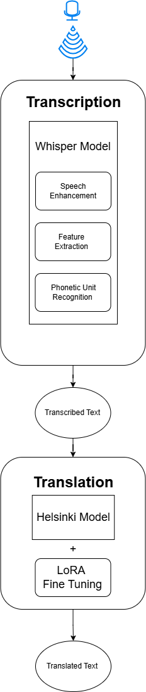

# Real-Time-Speech-Recognition-and-Translation
## Overview
The purpose of this project is a real-time speech recognition and English to Arabic translation. In this project we levarage advanced natural language processing and speech technologies to facilitate instantaneous translation. Finally, the project is displayed in a user-friendly interface where the user talks into the microphone and the translated text is displayed on the screen.

## Project Structure
The project is divided into two main parts: the speech recognition and the translation. The speech recognition is done using Meta's Whisper V3 pretrained model. The output transcribed english text is then fed into Helsinki English to Arabic translation model. 

## Model Overview

## Whisper Model

Whisper is an automatic speech recognition (ASR) system trained on 680,000 hours of multilingual and multitask supervised data collected from the web.
For our project we utilized this model to transcribe the speech to text.

### Evaluation
#### Common Voice Dataset
Common Voice is an audio dataset that consists of a unique MP3 and corresponding text file. The dataset consists of 7,335 validated hours in 60 languages.
For the evaluation we evaluated Whisper on a sample of the Common Voice dataset. 

#### Rogue Scores
| Metric       | Precision           | Recall             | F1                |
|--------------|----------------------|--------------------|-------------------|
| **Rouge_1**  | 0.9415822418889903   | 0.9426635481083333 | 0.9419391677910781|
| **Rouge_2**  | 0.9064298857243641   | 0.9075811032866249 | 0.906802859490404 |
| **Rouge_L**  | 0.9415822418889903   | 0.9426635481083333 | 0.9419391677910781|
#### BLEU Score
| Metric       | Score               |
|--------------|---------------------|
| **BLEU**     | 0.6801078611053675  |

## Helsinki Model

Helsinki model is a powerful neural machine translation model designed to translate text between various language pairs. It employs transformer architecture to achieve state-of-the-art results in language translation by leveraging massive multilingual datasets. The model's versatility lies in its ability to handle both high-resource and low-resource language pairs, making it a robust choice for diverse translation tasks. In our project, the Helsinki model is fine-tuned using Low-Rank Adaptation (LoRA) to optimize performance for speech-to-text translation. This fine-tuning ensures that the model adapts to the nuances of spoken language, delivering accurate and contextually relevant translations.

## Installtion

## Running the model
